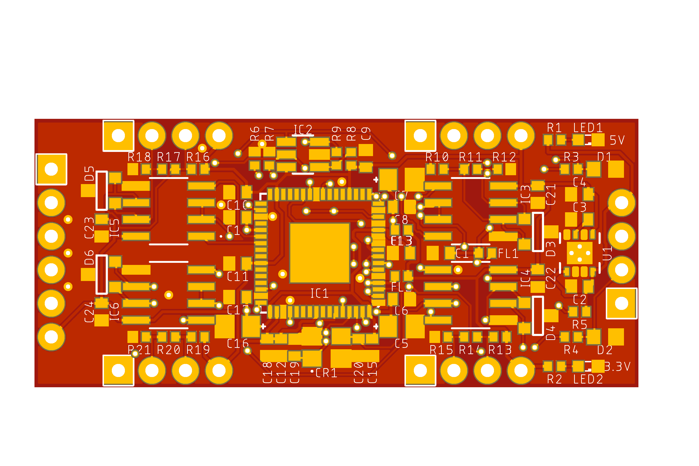
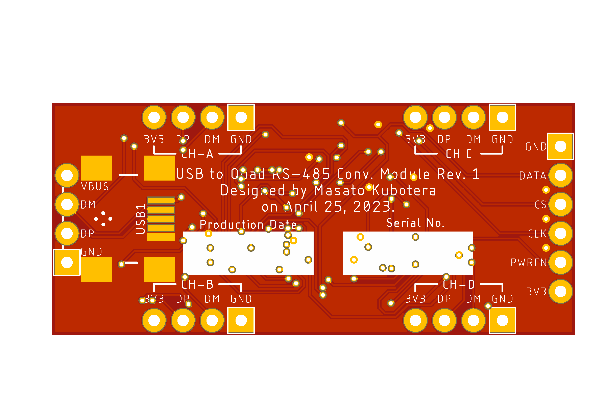
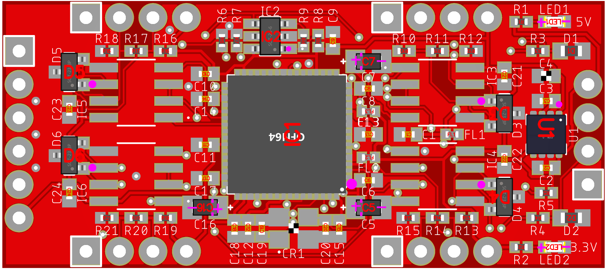

<html lang="en">

<head>
	<meta charset="uft-8">
	<meta name="author" content="Masato Kubotera">
    <meta name="description" content="">
</head>

<body>
	<h1>PCB / PCBA Order</h1>
        

            PCB/PCBA ordering were outsourced to <a href="https://jlcpcb.com/">JLCPCB</a>. 
            The following files were used to generate files for PCB/PCBA orders.
            <ul>
                <li>Eagle Design File:
                    <a href="https://github.com/JLCPCB/jlcpcb-eagle/blob/master/design%20rules/jlcpcb-2layers.dru">jlcpcb-2layers.dru</a>
                </li>
                <li>Eagle CAM File:
                    <a href="https://github.com/JLCPCB/jlcpcb-eagle/blob/master/cam/jlcpcb_2_layer_v9.cam">jlcpcb_2_layer_v9.cam</a>
                </li>
                <li>BOM/CPL Exporter ULPs:
                    <a href="https://github.com/JLCPCB/jlcpcb-eagle/blob/master/ulps/jlcpcb_smta_exporter.ulp">jlcpcb_smta_exporter.ulp</a>
                </li>
            </ul>
            These are distributed in <a href="https://github.com/JLCPCB/jlcpcb-eagle">github.com/JLCPCB/jlcpcb-eagle</a>. 
        

    <h2>PCB Order Specifications</h2>
        
           
            <table>
                <tr>
                    <th>PCB Top Image</th>
                    <th>PCB Bottom Image</th>
                </tr>
                <tr>
                    <td></td>
                    <td></td>
                </tr>
            </table>
            The following  files used to order the PCB and their specifications. 
            <ul>
                <li>Gerber data: <a href="Gerber_date.zip">Gerber_date.zip</a></li>
            </ul>
            

                
Click for more specifications

                <ul>                
                    <li>Base Material: FR-4</li>
                    <li>Layers: 2</li>
                    <li>Dimension: 45.72 mm* 20.32 mm</li>
                    <li>Product Type: Industrial/Consumer electronics</li>
                    <li>Different Design: 1</li>
                    <li>Delivery Format: Single PCB</li>
                    <li>PCB Thickness: 1.6</li>
                    <li>Impedance Control: no</li>
                    <li>PCB Color: Red</li>
                    <li>Silkscreen: White</li>
                    <li>Surface Finish: HASL(with lead)</li>
                    <li>Outer Copper Weight: 1 oz</li>
                    <li>Via Covering: Tented</li>
                    <li>Board Outline Tolerance: ±0.2mm(Regular)</li>
                    <li>Confirm Production file: No</li>                
                    <li>Remove Order Number: Yes</li>
                    <li>Deburring/Edge rounding: No</li>
                    <li>Flying Probe Test: Fully Test</li>
                    <li>Gold Fingers: No</li>
                    <li>Castellated Holes: No</li>
                    <li>4-Wire Kelvin Test: No</li>
                    <li>Paper between PCBs: No</li>
                    <li>Appearance Quality: IPC Class 2 Standard</li>
                    <li>Silkscreen Technology: Ink-jet/Screen Printing</li>
                    <li>Package Box: With JLCPCB logo</li>
                </ul>
            

        

    <h2>PCBA Order Specifications</h2>
        

            <table>
                <tr><th>PCBA Image</th></tr>
                <tr><td></td></tr>
            </table>
            The following files used to order the PCBA and their specifications.
            <ul>
                <li>BOM File: <a href="USB-to-Quad-RS-485-Conv-Module_top_bom.csv">USB-to-Quad-RS-485-Conv-Module_top_bom.csv</a></li>
                <li>CPL File: <a href="USB-to-Quad-RS-485-Conv-Module_top_cpl.csv">USB-to-Quad-RS-485-Conv-Module_top_cpl.csv</a></li>
            </ul>
            The following components were installed by PCBA.
            <table>
                <tr>
                    <th>Part Image</th>
                    <th>Top Designator</th>
                    <th>MFR.Part #</th>
                    <th>JLCPCB Part #</th>
                    <th>Manufacturer</th>
                    <th>Part Detail</th>
                </tr>
                <tr>
                    <td></td>
                    <td>C1,C3</td>
                    <td>CC0402JRX7R9BB103</td>
                    <td><a href="https://jlcpcb.com/partdetail/Yageo-CC0402JRX7R9BB103/C272878">C272878</a></td>
                    <td>YAGEO</td>
                    <td>Multilayer Ceramic Capacitor SMD 10nF 50V ±5% X7R 0402</td>
                </tr>
                <tr>
                    <td></td>
                    <td>C2</td>
                    <td>CC0402KRX7R5BB105</td>
                    <td><a href="https://jlcpcb.com/partdetail/Yageo-CC0402KRX7R5BB105/C115046">C115046</a></td>
                    <td>YAGEO</td>
                    <td>Multilayer Ceramic Capacitor SMD 1uF 6.3V ±10% X7R 0402</td>
                </tr>
                <tr>
                    <td></td>
                    <td>C4</td>
                    <td>GRM155Z71A225KE01D</td>
                    <td><a href="https://jlcpcb.com/partdetail/3468099-GRM155Z71A225KE01D/C2997286">C2997286</a></td>
                    <td>Murata Electronics</td>
                    <td>Multilayer Ceramic Capacitor SMD 2.2uF 10V ±10% X7R 0402</td>
                </tr>
                <tr>
                    <td></td>
                    <td>C5,C7,C16</td>
                    <td>TAJR475K006RNJ</td>
                    <td><a href="https://jlcpcb.com/partdetail/KyoceraAvx-TAJR475K006RNJ/C308815">C308815</a></td>
                    <td>Kyocera AVX</td>
                    <td>Tantalum Capacitor SMD 4.7uF 6.3V ±10% 7Ω@100kHz 0805</td>
                </tr>
                <tr>
                    <td></td>
                    <td>C6,C8,C9,C10,C11,C12,C13,C14,C15,C17,C18,C21,C22,C23,C24</td>
                    <td>CC0402JRX7R7BB104</td>
                    <td><a href="https://jlcpcb.com/partdetail/Yageo-CC0402JRX7R7BB104/C541464">C541464</a></td>
                    <td>YAGEO</td>
                    <td>Multilayer Ceramic Capacitor SMD 100nF 16V ±5% X7R 0402</td>
                </tr>
                <tr>
                    <td></td>
                    <td>C19,C20</td>
                    <td>CC0402GRNPO9BN300</td>
                    <td><a href="https://jlcpcb.com/partdetail/Yageo-CC0402GRNPO9BN300/C277479">C277479</a></td>
                    <td>YAGEO</td>
                    <td>Multilayer Ceramic Capacitor SMD 30pF 50V ±2% NP0 0402</td>
                </tr>
                <tr>
                    <td></td>
                    <td>CR1</td>
                    <td>7V12006001</td>
                    <td><a href="https://jlcpcb.com/partdetail/TxcCorp-7V12006001/C5203634">C5203634</a></td>
                    <td>TXC Corp</td>
                    <td>Crystal 12Hz ±30ppm 12pF SMD 3225-4P</td>
                </tr>
                <tr>
                    <td></td>
                    <td>D1,D2</td>
                    <td>PGB1010603MR</td>
                    <td><a href="https://jlcpcb.com/partdetail/Littelfuse-PGB1010603MR/C142698">C142698</a></td>
                    <td><a href="https://m.littelfuse.com/products/polymer-esd-suppressors/pulseguard-esd-suppressors/pgb10603">Littelfuse</a></td>
                    <td>ESD Suppressor SMD 24V 0.06pF 0603</td>
                </tr>
                <tr>
                    <td></td>
                    <td>D3,D4,D5,D6</td>
                    <td>CDSOT23-SM712</td>
                    <td><a href="https://jlcpcb.com/partdetail/Bourns-CDSOT23SM712/C404012">C404012</a></td>
                    <td><a href="https://www.bourns.com/products/diodes/diode-arrays/product/CDSOT23-SM712">BOURNS</a></td>
                    <td>TVS Diodes Array SMD 7V 400W SOT-23</td>
                </tr>
                <tr>
                    <td></td>
                    <td>FL1,FL2,FL3</td>
                    <td>BLM15AX601SN1D</td>
                    <td><a href="https://jlcpcb.com/partdetail/MurataElectronics-BLM15AX601SN1D/C76886">C76886</a></td>
                    <td>Murata Electronics</td>
                    <td>Ferrite Bead SMD 600Ω ±25% 500mA 0402</td>
                </tr>
                <tr>
                    <td></td>
                    <td>IC1</td>
                    <td>FT4232HQ-REEL</td>
                    <td><a href="https://jlcpcb.com/partdetail/Ftdi-FT4232HQREEL/C2651882">C2651882</a></td>
                    <td><a href="https://ftdichip.com/products/ft4232hq/">FTDI</a></td>
                    <td>Quad High Speed USB to Multipurpose UART/MPSSE SMD 64-Pin QFN</td>
                </tr>
                <tr>
                    <td></td>
                    <td>IC2</td>
                    <td>93LC56BT-I/OT</td>
                    <td><a href="https://jlcpcb.com/partdetail/MicrochipTech-93LC56BT_IOT/C190271">C190271</a></td>
                    <td><a href="https://www.microchip.com/en-us/product/93LC56B">Microchip Tech</a></td>
                    <td>16-Bit EEPROM SMD SOT-23-6</td>
                </tr>
                <tr>
                    <td></td>
                    <td>LED1,LED2</td>
                    <td>SML-D12V1WT86</td>
                    <td><a href="https://jlcpcb.com/partdetail/RohmSemicon-SMLD12V1WT86/C253533">C253533</a></td>
                    <td>ROHM Semicon</td>
                    <td>Standard LED SMD RED 2.2V 20mA 630nm 0603</td>
                </tr>
                <tr>
                    <td></td>
                    <td>R1,R2</td>
                    <td>RC0402FR-071KL</td>
                    <td><a href="https://jlcpcb.com/partdetail/Yageo-RC0402FR071KL/C106235">C106235</a></td>
                    <td>YAGEO</td>
                    <td>Thick Film Resistor SMD 1kΩ 1/10W ±1% 0402</td>
                </tr>
                <tr>
                    <td></td>
                    <td>R3,R4</td>
                    <td>RC0402FR-0710RL</td>
                    <td><a href="https://jlcpcb.com/partdetail/Yageo-RC0402FR0710RL/C138066">C138066</a></td>
                    <td>YAGEO</td>
                    <td>Thick Film Resistor SMD 10Ω 1/10W ±1% 0402</td>
                </tr>
                <tr>
                    <td></td>
                    <td>R5</td>
                    <td>RC0402FR-0715KL</td>
                    <td><a href="https://jlcpcb.com/partdetail/12030-0402WGF1872TCE/C11476">C11476</a></td>
                    <td>YAGEO</td>
                    <td>Thick Film Resistor SMD 15kΩ 1/10W ±1% 0402</td>
                </tr>
                <tr>
                    <td></td>
                    <td>R6,R8</td>
                    <td>RC0402FR-0710KL</td>
                    <td><a href="https://jlcpcb.com/partdetail/Yageo-RC0402FR0710KL/C60490">C60490</a></td>
                    <td>YAGEO</td>
                    <td>Thick Film Resistor SMD 10kΩ 1/10W ±1% 0402</td>
                </tr>
                <tr>
                    <td></td>
                    <td>R7</td>
                    <td>RC0402FR-0712KL</td>
                    <td><a href="https://jlcpcb.com/partdetail/Yageo-RC0402FR0712KL/C114760">C114760</a></td>
                    <td>YAGEO</td>
                    <td>Thick Film Resistor SMD 12kΩ 1/10W ±1% 0402</td>
                </tr>
                <tr>
                    <td></td>
                    <td>R9</td>
                    <td>RC0402FR-072KL</td>
                    <td><a href="https://jlcpcb.com/partdetail/Yageo-RC0402FR072KL/C60488">C60488</a></td>
                    <td>YAGEO</td>
                    <td>Thick Film Resistor SMD 2kΩ 1/10W ±1% 0402</td>
                </tr>
                <tr>
                    <td></td>
                    <td>R10,R12,R13,R15,R16,R18,R19,R21</td>
                    <td>RC0402FR-07680RL</td>
                    <td><a href="https://jlcpcb.com/partdetail/Yageo-RC0402FR07680RL/C137948">C137948</a></td>
                    <td>YAGEO</td>
                    <td>Thick Film Resistor SMD 680Ω 1/10W ±1% 0402</td>
                </tr>
                <tr>
                    <td></td>
                    <td>R11,R14,R17,R20</td>
                    <td>RC0402FR-07120RL</td>
                    <td><a href="https://jlcpcb.com/partdetail/Yageo-RC0402FR07120RL/C114758">C114758</a></td>
                    <td>YAGEO</td>
                    <td>Thick Film Resistor SMD 120Ω 1/10W ±1% 0402</td>
                </tr>
                <tr>
                    <td></td>
                    <td>U1</td>
                    <td>TPS73533DRBT</td>
                    <td><a href="https://jlcpcb.com/partdetail/TexasInstruments-TPS73533DRBT/C115872">C115872</a></td>
                    <td><a href="https://www.ti.com/product/en-us/TPS735/part-details/TPS73533DRBT">Texas Instruments></a></td>
                    <td>Linear Voltage Regulator 3.3V 500mA SMD VSON-8-EP</td>
                </tr>
            </table>
            The following component was not installed by PCBA due to availability.
            <table>
                <tr>
                    <th>Part Image</th>
                    <th>Top Designator</th>
                    <th>MFR.Part #</th>
                    <th>JLCPCB Part #</th>
                    <th>Manufacturer</th>
                    <th>Part Detail</th>
                </tr>
                <tr>
                    <td></td>
                    <td>IC3,IC4,IC5,IC6</td>
                    <td>ADM3078EARZ</td>
                    <td><a href="https://jlcpcb.com/partdetail/AnalogDevices-ADM3078EARZ/C658187">C658187</a></td>
                    <td><a href="https://www.analog.com/en/products/adm3078e.html">Analog Devices</a></td>
                    <td>RS-485/RS-422 Transceiver 16Mbps SMD SOIC-8</td>
                </tr>
            </table>
            These selected parts are listed in <a href="bom.xls">bom.xls</a>. 
            

                
Click for more specifications

                <ul>                
                    <li>PCBA Type: Economic</li>
                    <li>Assembly Side: Top Side</li>
                    <li>Tooling holes: Added by JLCPCB</li>
                    <li>Confirm Parts Placement: No</li>
                </ul>
            

        

</body>

</html>
